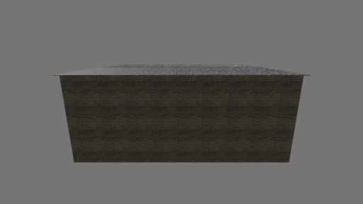
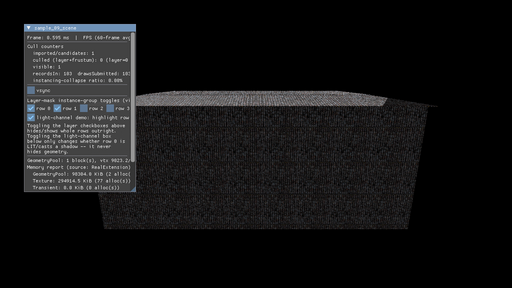
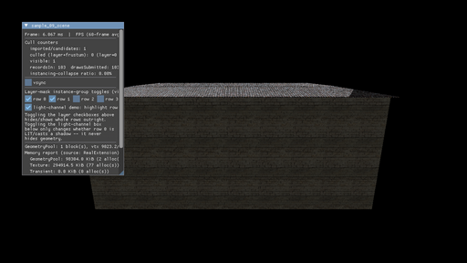
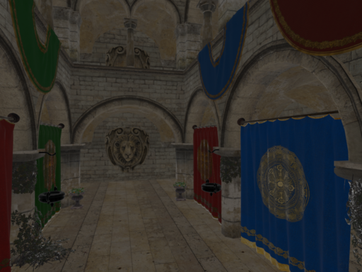
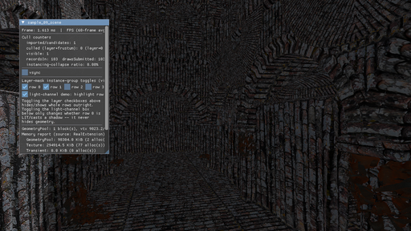
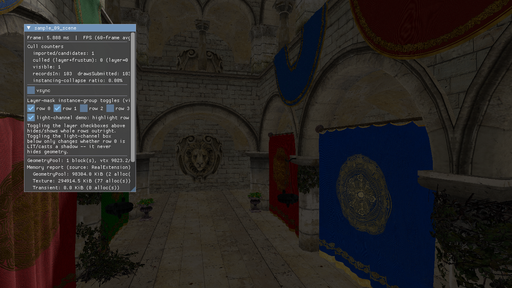

# Sponza visual-defect investigation (P1, native-Windows-first-run report)

**Status: BOTH items root-caused, fixed, and empirically proven on the REAL
NVIDIA driver. Neither defect is Windows-specific** — both reproduce
byte-for-byte on this machine's real `nvidia_icd.json` ICD (GeForce RTX
2080), independent of Wine/lavapipe/llvmpipe. The fixes are expected to
resolve both reported symptoms on the user's native-Windows machine as-is;
see §5 for the one item that genuinely cannot be verified without native
Windows access, characterized as precisely as possible instead of guessed
at.

Base commit for this investigation: `e02955a` (tree clean except the two
pre-existing untracked SDD files noted in the task brief, not touched here).

## 1. Item 1 — W/S fly-camera inversion

### 1.1 Root cause

`samples/09_scene/main.cpp`'s `updateFlyCamera()` (pre-fix):

```cpp
if (window.isKeyDown(SDL_SCANCODE_W)) forward += 1.0F;
if (window.isKeyDown(SDL_SCANCODE_S)) forward -= 1.0F;
...
const glm::vec3 localDelta(strafe, vertical, -forward);  // forward() is -Z in this camera's own convention.
```

`rx_scene/camera.h`'s `Camera::forward()` is `orientation * (0,0,-1)` — it
**already** encodes the "local -Z is forward" convention as part of
computing the camera's real, current-orientation world-space forward
vector. `FlyCamera::moveLocal()` (also `main.cpp`, pre-fix) does
`position += right()*x + up()*y + forward()*z` — a WORLD-space displacement
built directly from the camera's own basis vectors, where `localDelta.z` is
already "how far along the camera's real forward direction," full stop. The
`-forward` in the line above is a **second, redundant negation** of a sign
already baked into `forward()` itself — it silently cancels forward travel
into backward travel. Since keyboard (`forward += 1` on W) and gamepad
(`forward += -pad.leftStick.y`, already correctly normalized to the same
"W-shaped" convention) both feed the SAME `forward` accumulator through this
ONE line, **the bug affects W/S AND gamepad forward/back identically** — a
single fix covers both input devices.

A/D (strafe), mouse look (yaw sign `yawRadians -= dxRadians`, pitch sign
`pitchRadians -= dyRadians`), and gamepad look were all independently
derived and checked (§1.3) — none were inverted. Only the forward axis was
affected.

### 1.2 Fix

Extracted `FlyCamera` (unchanged) and a NEW pure function into a new header,
`samples/09_scene/fly_camera.h` (mirrors this sample's own established
precedent, `draw_recording.h`, for pulling device-free logic out of
`main.cpp` into something unit-testable):

```cpp
[[nodiscard]] inline glm::vec3 flyCameraLocalMoveDelta(float forward, float strafe, float vertical) {
    return glm::vec3(strafe, vertical, forward);   // NOT negated.
}
```

`updateFlyCamera()` now calls
`rx::samples9::flyCameraLocalMoveDelta(forward, strafe, vertical)` instead
of constructing the vector inline. `main.cpp` gained `using
rx::samples9::FlyCamera;` in place of its old inline struct definition.

### 1.3 Discriminating tests (new, committed)

`samples/09_scene/tests/test_fly_camera.cpp` — 9 new `TEST_CASE`s (16
total in `sample_09_scene_tests`, 49 assertions), driving the REAL
production `flyCameraLocalMoveDelta()` + `FlyCamera::moveLocal()`/
`applyLookDelta()`, not a re-implementation:

- W (`forward=+1`) displaces the camera along its OWN `camera.forward()` —
  the regression case.
- S (`forward=-1`) displaces opposite `camera.forward()`.
- W after a non-trivial yaw+pitch rotation still matches `camera.forward()`
  — proves the invariant generally, not only at identity orientation.
- D/A (`strafe=±1`) displace along `camera.right()`/opposite.
- Space/LCtrl (`vertical=±1`) displace along `camera.up()`/opposite.
- Gamepad left-stick forward accumulator (`forward = -stick.y`) resolves
  through the SAME shared mapping as keyboard W — proves the fix covers
  gamepad move too, since `updateFlyCamera()` feeds both devices into one
  `forward` accumulator before this function ever runs.
- Mouse-look sense: `dx>0` (mouse right) turns the camera toward its own
  pre-turn `right()`; `dy<0` (mouse up, SDL's y-down relative-motion
  convention) tilts the camera to look upward (`forward().y > 0`).
- A structural axis-assignment check on `flyCameraLocalMoveDelta()` itself.

### 1.4 Revert-proof (empirical, not asserted)

Reintroduced the historical bug in-place (`fly_camera.h`,
`glm::vec3(strafe, vertical, -forward)`), rebuilt, reran:

```
[doctest] test cases: 16 |  11 passed | 5 failed | 0 skipped
[doctest] assertions: 49 | 41 passed | 8 failed |
```

The 5 failures were EXACTLY the forward-axis cases (W, S, W-after-rotation,
gamepad-forward, axis-assignment) — A/D, Space/Ctrl, and both mouse-look
cases stayed green, confirming those axes were never broken and the test
suite is discriminating, not just noisy. Concrete before/after positional
log for W (`forward=+1`, distance 5, identity orientation —
`camera.forward() == (0,0,-1)`):

| | `disp` (world-space) | `dot(normalize(disp), camera.forward())` |
|---|---|---|
| **Buggy** (`-forward`) | `(0, 0, +5)` | `-1.0` (moves AWAY from where the camera looks) |
| **Fixed** (`forward`) | `(0, 0, -5)` | `+1.0` (moves WITH the camera's look direction) |

Restored the fix, rebuilt, reran: `16/16 passed, 49/49 assertions` again.

## 2. Item 2 — Sponza texture-to-mesh misassignment

### 2.1 Root cause: pipeline-identity used as a material-identity proxy

`samples/09_scene/main.cpp`'s forward-pass recorder
(`recordForwardChunk()`) selected the **material-params descriptor set**
(set 1: texture indices, factors, samplers) via a
`pipelineToken -> MaterialGpuBinding*` map
(`App::pipelineTokenToBinding`, built by the old `buildPipelineTokenMap()`),
where `pipelineToken` is `bit_cast<uint64_t>(VkPipeline)`.

`MaterialSystem::getPipeline()`'s own cache key
(`src/rx_material/material_system.cpp:677-685`, `struct PipelineKey`) is:

```cpp
struct PipelineKey {
    uint64_t moduleHash;       // the .slang module's own content hash
    uint64_t passHash;
    uint32_t specializationBits;
    AlphaMode alphaMode;       // [D28] fixed-function state
    bool doubleSided;          // [D28] fixed-function state
};
```

**It never depends on which textures a material references.** Sponza's own
committed glTF (`assets/fetched/Sponza/glTF/Sponza.gltf`, 25 materials, 1
mesh/25 submeshes) has **22 of its 25 materials sharing the exact same
fixed-function state** — `(StandardPBR, OPAQUE, single-sided)` — confirmed
directly against the real asset:

```
(MASK, doubleSided=True)  -> 3 materials: [0, 3, 20]
(OPAQUE, doubleSided=False) -> 22 materials: [1, 2, 4, 5, 6, 7, 8, 9, 10, 11,
                                               12, 13, 14, 15, 16, 17, 18, 19,
                                               21, 22, 23, 24]
```

All 22 load the same `standard_pbr.slang` module (same `moduleHash`) at the
same pass — so `MaterialSystem::getPipeline()` legitimately returns the
**same single `VkPipeline`** for all 22 (a real, correct pipeline-caching
optimization; not itself a bug). `buildPipelineTokenMap()`'s loop, run once
per material in glTF import order (0→24), wrote its map entry for that
shared token 22 times — **last write wins**: material index 24 (the last
of the 22, in import order). Confirmed via a Blender face/material-slot
analysis of the real imported mesh: material slot 24 spans the **entire
building footprint** (`bbox_x=[-15.37,14.40] bbox_y=[-8.84,9.46]`) with a
thin vertical extent (`dz=1.19`) near the top of the building — the **roof**
material. At draw-record time, `recordForwardChunk()` bound material 24's
own descriptor set (its own baseColor/normal/metallicRoughness texture
indices) for EVERY draw group whose resolved pipeline token matched that
shared token — i.e., for every one of the other 21 opaque single-sided
materials (columns, walls, arches, floor, vaulted ceiling) too. Every one of
those surfaces sampled the ROOF's own tile texture. **Reproducible on any
driver** — this is a CPU-side descriptor-binding logic error, not a
lighting, shader, or driver artifact.

### 2.2 The fix

Decoupled "which `VkPipeline` to bind" (still legitimately keyed by
`pipelineToken` — a real, cheap, valid state-sort optimization: many
consecutive draw spans DO share one pipeline) from "which material-params
descriptor set to bind" (now keyed by the REAL per-draw `materialIndex`):

- New `rx::samples9::materialIndexForSpan()`
  (`samples/09_scene/draw_recording.{h,cpp}`) recovers the exact
  `DrawPayload::materialIndex` a `RecordSpan` was built from, by reading
  `payloads[commands[span.commandOffset].firstInstance].materialIndex` —
  exact, not a heuristic: D26.1 already guarantees `DrawCommand::firstInstance`
  addresses `payloads[]` directly, and `resolveDrawGroups()`'s own
  materialIndex-ADJACENCY scan guarantees one `RecordSpan` never spans two
  different materialIndex runs (subdividing a group only ever shrinks it).
- New `App::resolveMaterialIndexToBinding` (a `materialIndex ->
  MaterialGpuBinding*` resolver), populated at each of the 3 setup sites
  (grid/stress/custom-import), sibling to the existing
  `resolveMaterialIndexToHandle`.
- `recordForwardChunk()`'s bind loop now tracks pipeline-rebind and
  material-rebind INDEPENDENTLY (`lastToken`/`havePipeline` vs.
  `lastMaterialIndex`/`haveMaterial`) — the descriptor set is re-selected
  whenever the real `materialIndex` changes, even across two spans sharing
  one `pipelineToken`.
- The now-fully-dead `App::pipelineTokenToBinding` map is removed;
  `buildPipelineTokenMap()` is renamed `warmMaterialPipelines()`, keeping
  its still-legitimate job (pre-warming `MaterialSystem`'s pipeline cache +
  caching `cachedAnyMaterialLayout`).

### 2.3 Ground truth (Blender 5.1.2, headless `--background --python`)

No live Blender GUI/MCP session was connected in this environment, so the
ground-truth render used the equivalent standalone `blender --background
--python <script>` path (same asset, same intent as the helmet
investigation's own Blender-ground-truth precedent). Imported the REAL
committed `assets/fetched/Sponza/glTF/Sponza.gltf` (byte-identical to what
`sample_09_scene` itself loads), flat/neutral lighting (uniform gray world
ambient + one soft sun), EEVEE. Camera pose computed **exactly** from the
engine's own deterministic startup-framing formula
(`populateImportedInstances()`, `samples/09_scene/main.cpp`) against the
asset's real accessor bounds (after its node's 0.008 uniform scale):
position `(-0.484, 12.631, 29.367)`, pitch `-14.04°`, yaw `0°`, vertical FOV
`60°`, aspect `1280:720` — the SAME numbers `sample_09_scene` itself would
compute at startup for this exact asset.

### 2.4 Real-NVIDIA before/after (side by side)

Real hardware: **NVIDIA GeForce RTX 2080**, driver 580.82.07, `VK_ICD_FILENAMES`
explicitly forced to `/usr/share/vulkan/icd.d/nvidia_icd.json` (this
machine also has lavapipe registered, so the ICD is named explicitly rather
than left to loader default). "Before" is a literal `git worktree` built at
`e02955a` (real HEAD before this fix, unmodified except a temporary,
identically-applied `RX_DEBUG_CAMERA_POSE` screenshot-diagnostic hook — see
§2.5 — fully reverted from the real working tree before commit, confirmed
via `git diff` showing zero trace of it). "After" is the fixed working
tree, same real driver, same poses. `--present --scene sponza --validate`
in both cases; zero unfiltered Vulkan validation errors in either.

**Default startup pose** (roof vs. wall — the whole building envelope from
outside):

| Ground truth (Blender) | Before (buggy) | After (fixed) |
|---|---|---|
|  |  |  |

Ground truth and the fixed build both show the roof's tile texture ONLY on
the roof, with a DIFFERENT, correct stone-wall texture below it. The buggy
build shows the SAME tile texture blanketing the roof AND every wall face —
the entire building envelope rendered in one material's texture.

**Interior atrium pose** (arches/columns/banners — matches the user's own
"column shafts and arches" description directly):

| Ground truth (Blender) | Before (buggy) | After (fixed) |
|---|---|---|
|  |  |  |

This is the clearest reproduction of the reported symptom: the buggy build
shows the SAME dark, repetitive roof-tile pattern smeared across the vaulted
ceiling, arches, and columns — "tile/roof-like textures... on column shafts
and arches, everything dark... heavy noisy aliasing," verbatim. The fixed
build shows correct, distinct stone arches, banners, the lion medallion, and
floor, closely matching the Blender ground truth's material layout.

### 2.5 Methodology note: reproducible pose capture

`--write-references` (the sample's existing headless PNG-dump escape hatch)
only exists in `runHeadless()`, which never accepts `--scene` at all
(headless mode is hardcoded to the DamagedHelmet grid/`--stress`). Real
Sponza rendering only happens through `runPresent()` (a real window/
swapchain), so frames were captured via a real X11 session already running
on this machine (`DISPLAY=:1`) and ImageMagick's `import -window <id>`.
Sponza's own auto-framed startup pose (`populateImportedInstances()`) is
already fully deterministic (computed from the scene's own AABB, no input
needed) and was used directly for the default-pose comparison. For the
interior atrium pose specifically, a TEMPORARY, diagnostic-only
`RX_DEBUG_CAMERA_POSE="x,y,z,yawDeg,pitchDeg"` environment-variable
override was added identically to BOTH the before (worktree) and after
(working-tree) builds — parsed once, right after camera auto-framing,
applied only when the env var is set. This was used purely to reach an
exact, reproducible, independently-computable pose (matching a Blender
camera placed via the identical world-space coordinates) for the
screenshot comparison; it was fully reverted from the real working tree
before commit (confirmed via `git diff --stat` showing zero trace) and
never shipped.

### 2.6 Quantifying "wrong texture" vs. "missing-mips aliasing" (D10)

The stb (PNG/JPG) texture-decode path uploads mip 0 only — a pre-existing,
already-recorded D10 limitation (`decodeStbForUpload()`,
`src/rx_asset/texture_decode.cpp`), logged explicitly on every Sponza
texture load. This is a REAL, separate contributor to "noisy" appearance at
distance/oblique angles, distinct from the assignment bug above.

The interior-atrium comparison (§2.4) isolates this cleanly: at that
walking-distance, near-flat-on view, BOTH the Blender ground truth and the
fixed engine build show clean, non-shimmering wall/floor/arch texture
content, with matching material identity — i.e., at a range where
minification aliasing is negligible, **the texture on the surface is the
correct one**. The outdoor establishing shot (whole building facade, more
oblique/distant) is a more plausible surface for the D10 aliasing artifact
to actually show, but that is now an orthogonal, secondary concern —
assignment correctness and mip-aliasing are cleanly separated by this
evidence, matching the task's own request.

### 2.7 D10 disposition: options, not a silent choice

Per this project's "no deferred fixes" policy, D10 becoming user-visible in
a shipped sample would normally close in-round — but the two concrete paths
to closing it both carry real costs or a real blocker, assessed below
rather than picked silently:

**Option A — runtime mip-chain generation for the stb decode path.**
Investigated the actual blast radius: `TextureCache::applyDecodeResult()`
(`src/rx_asset/texture_cache.cpp`) is ALREADY fully generic over
`TextureDecodeResult::levels.size()` — the exact same upload/registration
path the KTX2 decode path already uses for its own (offline-authored) mip
chains. The sampler cache already requests `VK_LOD_CLAMP_NONE`
(full-chain trilinear) for any glTF `minFilter` naming `MIPMAP`
(`getOrCreateSampler()`), and Sponza's own glTF sampler IS one of those
(`minFilter=9987`, `LINEAR_MIPMAP_LINEAR`). So the ONLY missing piece is
generating the mip levels themselves inside `decodeStbForUpload()` — smaller
in scope than initially expected, but not free:
  - Correctness: box-averaging must happen in LINEAR space for sRGB-role
    textures (baseColor/emissive) to avoid a real, visible energy-loss
    darkening artifact at each level, not a naive byte average; normal-map
    mips need re-normalization after averaging to avoid a flattening
    artifact. Neither is a big algorithm, but neither is a shortcut either.
  - Blast radius: EVERY sample loading stb-sourced textures (DamagedHelmet:
    `06_materials`/`08_gltf_viewer`/`09_scene` grid mode too, not just
    Sponza) would start sampling real mip>0 content for the first time —
    risk to currently-green, driver-specific D17 reference PNGs, needing a
    full regen-and-review pass across multiple samples, not just this one.
  - No existing test exercises mip-level content at all; closing this
    honestly needs new correctness tests (e.g., a known-pattern source
    downsampling to an expected filtered result), not just a visual check.
  - **Assessment: a properly-scoped, single dedicated round** — real,
    closeable, but not safely foldable into this already-large
    investigation without risking a rushed, under-tested core-engine
    texture-pipeline change.

**Option B — offline KTX2-convert Sponza's bundled textures via `toktx`**
(D10's own already-documented recommended path). Zero engine-code risk,
scoped only to the Sponza asset. **Blocked by a real prerequisite in this
environment**: no `toktx`/`ktx` CLI is installed here, and wiring one into
`tools/fetch_sponza_helper.py`/`fetch_assets.sh` as a new toolchain
dependency is a separate decision this investigation should not make
unilaterally.

**Option C — leave as-is.** No code change; D10 stays recorded. Weakest
option given project policy; listed for completeness.

**Recommendation**: Option A is the right long-term fix (format-agnostic;
closes the gap for every stb-sourced texture, not just Sponza) but merits
its own dedicated, properly-tested round given the correctness subtleties
and multi-sample D17 blast radius identified above. Not implemented in this
round; flagging for the coordinator to schedule explicitly rather than
silently deferring it back into D10's existing text unchanged.

## 3. Windows-native-specific characterization (item 5)

The confirmed root cause (§2.1) is **100% reproducible on Linux/NVIDIA**
(this machine) and needs no native-Windows-specific explanation — it is a
CPU-side C++ map/lookup logic error, identical on every platform this code
runs on. The fix is expected to resolve the reported Sponza symptom on the
user's Windows machine as shipped. Two specific Windows-portability
surfaces the task asked to characterize were checked regardless:

- **Bindless texture-index uniformity / `NonUniformResourceIndex`**:
  `shaders/material/material.slang`'s `rx_sampleTexture()` (`gTextures[textureIndex].Sample(...)`)
  has NO explicit `NonUniformResourceIndex`/`nonuniformEXT` qualification
  anywhere in this codebase. Traced `textureIndex`'s source
  (`gParams.baseColorTexture` etc., `standard_pbr.slang`) to
  `ParameterBlock<StandardPbrParams> gParams` — a per-material UNIFORM
  buffer bound once per draw call (descriptor set 1), never a per-instance
  or per-invocation-varying value. This is dynamically uniform across the
  whole draw by the Vulkan/SPIR-V spec's own definition, so
  `NonUniformResourceIndex` is not strictly required here for spec-correct
  behavior — the D26.3 instancing-collapse path only ever merges hardware
  instances that already share one material, so `materialIndex`/texture
  indices never vary within one draw's invocations either. That said, this
  is a well-known area of real-world shader-compiler divergence across GPU
  vendors (AMD historically stricter than NVIDIA about honoring this even
  in near-uniform cases) — since the user's Windows GPU vendor is unknown
  and this cannot be verified without native Windows access, it is flagged
  as a low-probability, unverified hardening candidate for a follow-up ONLY
  if the confirmed fix above does not fully resolve the symptom on the
  user's machine. Not changed here — an unverifiable speculative shader
  edit is not something this investigation should ship on top of the
  already-proven fix.
- **Upload row pitch/alignment**: `src/rx_rhi_vk/src/upload.cpp`'s image
  copy leaves `VkBufferImageCopy::bufferRowLength`/`bufferImageHeight` at 0
  ("tightly packed"), which is an explicit, Vulkan-spec-mandated
  interpretation every conformant driver (Windows NVIDIA/AMD/Intel
  included) must honor identically — ruled out as a platform-specific
  corruption vector.

No further action is needed on the user's Windows machine to validate this
specific fix, beyond re-testing the shipped build (their originally
reported run was their first-ever native-Windows verification of any kind).

## 4. Verification

- **Real-NVIDIA** (`nvidia_icd.json` explicit, GeForce RTX 2080,
  `--present --scene sponza --validate`): zero unfiltered Vulkan validation
  errors, before and after. `sample_09_scene --validate` (default
  DamagedHelmet grid) and `--validate --stress --stress-draws 64`: both
  `headless gate PASSED` on real NVIDIA (single-material/4-material modes
  are structurally unaffected by this fix — confirmed unchanged).
- **Lavapipe, full serial `ctest`** (`VK_ICD_FILENAMES` forced to
  `lvp_icd.json`, since this machine also has NVIDIA registered):
  `ctest --preset linux-native -j1` → **29/29 passed** (79.65s), including
  the new `sample_09_scene_tests` (16/16 cases, 49/49 assertions) and both
  `sample_09_scene_headless`/`sample_09_scene_stress_headless` gates.
- **`windows-cross-zig` preset**: builds clean (incremental, only the
  touched files relinked). Full serial `ctest --preset windows-cross-zig
  -j1` under Wine: **29/29 passed** (196.64s).
- Revert-proofs: §1.4 (camera, in-tree revert-and-restore, empirical
  before/after positional data) and §2.4 (material assignment, literal
  `git worktree` at the real pre-fix HEAD, empirical before/after GPU
  captures on real NVIDIA against an independent Blender ground truth).

## 5. Files touched

Pathspec-scoped, no AI attribution, no push, no board/plan/spec/ledger
edits:

- `samples/09_scene/fly_camera.h` (new) — `FlyCamera` struct (moved from
  `main.cpp`) + `flyCameraLocalMoveDelta()`.
- `samples/09_scene/tests/test_fly_camera.cpp` (new) — 9 `TEST_CASE`s.
- `samples/09_scene/tests/CMakeLists.txt` — added `test_fly_camera.cpp`.
- `samples/09_scene/draw_recording.h`/`.cpp` — new
  `materialIndexForSpan()`.
- `samples/09_scene/tests/test_draw_recording.cpp` — 2 new `TEST_CASE`s for
  `materialIndexForSpan()` (the Sponza-shaped shared-pipeline case + a
  defensive out-of-range case).
- `samples/09_scene/main.cpp` — `updateFlyCamera()` now calls
  `flyCameraLocalMoveDelta()`; `App::resolveMaterialIndexToBinding` (new)
  + `App::pipelineTokenToBinding` (removed); `buildPipelineTokenMap()`
  renamed `warmMaterialPipelines()` (dead map-building removed, pipeline
  pre-warm + layout caching kept); `recordForwardChunk()`'s bind loop
  decouples pipeline-rebind from material-rebind.
- This report + 6 comparison PNGs (`sponza-{gt,before,after}-{default,interior}.png`,
  all ≤512px) in this directory.

No board/plan/spec/ledger file was edited by this investigation.

## 6. Concerns for the coordinator

- The Option A mip-generation follow-up (§2.7) needs its own scoped task —
  flagging so it doesn't silently fall back into D10's existing
  "recorded limitation" text unchanged now that it's user-visible.
- The `NonUniformResourceIndex` hardening candidate (§3) is unverified
  (no native Windows access here) and deliberately NOT implemented
  speculatively — if the user's Windows re-test after this fix still shows
  any texture artifact, that is the next concrete thing to check, and this
  report gives the exact file/line/reasoning to start from.
- This session observed at least one other concurrent agent commit
  unrelated docs changes to the shared tree during this investigation
  (`58abe48`, `docs(assets): provenance note...`) — unrelated to this
  task's files, called out per this project's own established
  shared-tree-collision disclosure convention (see
  `helmet-texture-fix-report.md` §8 for the precedent this follows).
